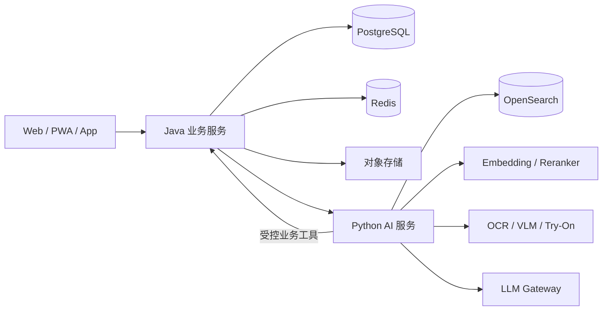

# 衣策——AI 服装购买决策平台开发文档

> 产品定位：懂用户身材、衣橱和真实购买结果的 AI 购衣决策系统。
>
> 本文区分“当前代码事实”和“目标设计”。目标设计不代表已经实现。

---

## 1. 产品定义

衣策不做综合电商平台，也不以聊天、虚拟人或商品数量作为核心竞争力。

衣策解决用户购买服装前最关键的五个问题：

1. 这件衣服是否适合我；
2. 应该选择什么尺码；
3. 哪些部位可能偏紧、偏松、偏长或偏短；
4. 它能否与我的已有衣物和使用场景匹配；
5. 是否值得购买，是否存在更合适的替代方案。

核心入口：

> 用户分享商品链接、商品截图或商品图片，系统在最少输入下生成一张可解释的“购衣决策卡”。

数字衣橱、身体档案和长期偏好不要求用户首次一次性录完，而是在多次决策、导入订单和反馈结果的过程中逐步形成。

虚拟试穿只负责视觉预览，不能代替真实尺码与合身判断。

---

## 2. 行业前 1% 的产品标准

“前 1%”不等于功能最多，而是以下能力同时成立。

### 2.1 首次使用立即产生价值

用户不注册完整衣橱，也能通过一张截图或一个商品链接获得：

- 建议购买、谨慎购买或不建议购买；
- 推荐尺码；
- 风险部位；
- 判断依据；
- 置信度；
- 缺失数据；
- 替代商品。

### 2.2 推荐必须可验证

系统不能只回答“这件很适合你”。每个关键结论必须关联证据：

- 用户身体数据；
- 商品实际测量值；
- 品牌和版型信息；
- 面料弹性；
- 用户历史合身反馈；
- 商品来源与更新时间。

数据不足时必须降低置信度或拒绝给出精确结论。

### 2.3 Agent 负责完成任务，而不是生成聊天文本

Agent 的价值是：

- 获取缺失信息；
- 读取用户档案和衣橱；
- 搜索并比较商品；
- 调用尺码、价格、库存和搭配工具；
- 检查硬约束；
- 组织证据；
- 请求用户确认；
- 保存购买与退货反馈。

价格、库存、尺码、购物车和订单事实由业务服务提供，不能由 LLM 猜测。

### 2.4 形成真实数据闭环

产品必须记录用户最终结果：

- 是否购买；
- 实际购买尺码；
- 是否留下；
- 是否退换货；
- 胸、肩、腰、臀、袖长、衣长、裤长的实际反馈；
- 用户是否采纳推荐；
- 实际穿着频率。

长期壁垒不是模型名称，而是“用户—商品—尺码—版型—购买结果”的真实反馈图谱。

### 2.5 用户保留最终控制权

AI 可以比较、筛选、解释和准备购物车，但正式下单和支付必须由用户确认。

---

## 3. 首发用户与核心场景

### 3.1 首发目标用户

优先服务：

- 频繁网购女装；
- 跨品牌尺码不稳定；
- 经常因不合身、不好搭或货不对版而退货；
- 愿意提供基础身体数据和收货反馈的用户。

首期不要同时覆盖所有人群和所有服装品类。建议优先覆盖女装上衣、外套、裤装和连衣裙。

### 3.2 场景一：单品购买判断

用户分享一件商品后，系统输出：

- 购买建议；
- 推荐尺码；
- 风险部位；
- 合身依据；
- 衣橱兼容度；
- 重复购买风险；
- 价格和退换风险；
- 相似替代品。

这是产品第一核心场景，也是新用户最低成本的入口。

### 3.3 场景二：尺码与版型分析

输入：

- 用户身体测量；
- 松紧偏好；
- 商品各尺码实测值；
- 面料弹性；
- 版型；
- 品牌偏差；
- 历史购买反馈。

输出示例：

> 推荐 M 码，置信度 82%。胸围预计为标准偏宽松，肩部余量较小，厚内搭时可能偏紧。商品缺少面料弹性数据，因此肩部判断存在不确定性。

### 3.4 场景三：衣橱兼容度

系统判断新商品与已有衣物能够形成多少套有效搭配，并说明：

- 可搭配的已有单品；
- 适用场景；
- 色彩和版型冲突；
- 与已有商品的重复程度；
- 新增该商品后衣橱覆盖能力的变化。

### 3.5 场景四：复杂购物任务

示例：

> 下周去上海面试三天，预算 1500 元，已有白衬衫和黑色皮鞋，准备两套正式但不老气的穿搭。

Agent 需要完成：

1. 识别场景、预算、日期、风格和排除条件；
2. 读取用户身体档案和已有衣橱；
3. 优先复用已有衣物；
4. 搜索真正缺少的单品；
5. 校验尺码、库存、预算和搭配完整性；
6. 输出多套可解释方案；
7. 用户确认后加入购物车。

### 3.6 场景五：订单和衣橱导入

支持：

- 上传其他平台订单截图；
- 分享或粘贴商品链接；
- 上传衣物实拍图；
- 手动补充关键字段。

OCR/VLM 自动识别后，低置信度字段必须由用户确认。

### 3.7 场景六：虚拟试穿

对已经通过尺码和搭配筛选的少量候选生成试穿预览，用于观察：

- 颜色；
- 整体轮廓；
- 上下装比例；
- 风格协调性。

首期不承诺真实布料物理效果、精确松量或高精度 3D 数字分身。

---

## 4. 产品差异化

衣策不与淘宝、京东等平台竞争商品规模，也不与纯虚拟试穿产品竞争生成效果。

核心差异化是四层决策能力：

1. **个人合身图谱**：记录用户在不同品类、品牌和部位上的真实合身结果；
2. **个人衣橱图谱**：理解已有衣物及其搭配关系；
3. **商品事实层**：管理 SKU 级实测尺寸、版型、弹性、库存、价格和退换规则；
4. **证据型 Agent**：综合上述事实，输出可解释、可追溯、可拒答的购买判断。

产品不以“AI 替用户下单”为卖点，而以“显著降低选择成本和买错概率”为卖点。

---

## 5. 商业模式

### 5.1 消费者端

免费能力：

- 有限次数的单品判断；
- 基础尺码建议；
- 基础衣橱管理。

付费能力：

- 高级尺码和部位风险分析；
- 完整衣橱兼容度；
- 场景购物任务；
- 多商品深度对比；
- 虚拟试穿；
- 长期购买与退货复盘。

### 5.2 交易佣金

用户通过推荐商品完成购买后获得导购佣金。推荐排序必须区分“商业合作”与“自然结果”，不能因佣金破坏用户利益。

### 5.3 商家端

当积累足够真实数据后，再提供：

- 尺码推荐 API；
- 商品版型标准化；
- 尺码相关退货分析；
- 商品信息质量检测；
- 购衣决策组件。

B 端能力不能在缺乏真实购买和退货数据时提前包装。

---

## 6. 当前项目事实与迁移目标

### 6.1 当前已有能力

当前项目已经具备：

- React 商品前端；
- FastAPI 商品和搜索服务；
- 文本、图片和图文检索；
- Agent 工具调用和会话记忆；
- 商品对比、会话购物车和模拟结算；
- Java 注册、登录和登录用户购物车 API。

### 6.2 当前主要问题

- 前端仍直接访问 Python；
- Java 与 Python 同时维护购物车；
- Java 尚未成为统一业务入口；
- H2、SQLite 和 H&M 静态数据不能支持正式产品；
- 当前检索评测主要是商品检索自身，不能证明真实用户效果；
- 缺少真实商品实测尺寸和购买反馈。

### 6.3 目标边界

- 浏览器和 App 只访问 Java；
- Java 是业务事实和交易动作的唯一入口；
- Python 只负责 Agent、RAG、多模态理解和模型推理；
- Python 不直接修改购物车、订单、用户和商品业务数据；
- H&M 数据只保留为过渡开发数据；
- 正式产品必须逐步接入真实中文商品和 SKU 数据。

---

## 7. 系统架构



### 7.1 Java 负责

- 统一 API；
- 用户、认证和权限；
- 身体档案；
- 数字衣橱；
- 商品、SKU、价格、库存和退换规则；
- 购物车和订单草稿；
- 购买、退货和合身反馈；
- 业务事务、幂等、审计和限流；
- 对 Python AI 服务进行编排。

### 7.2 Python 负责

- LangGraph Agent；
- Query 理解和任务规划；
- 多路召回、融合和重排；
- 尺码与版型计算；
- 衣橱兼容度和搭配评分；
- OCR/VLM 商品导入；
- 虚拟试穿；
- Agent、检索和模型评测。

### 7.3 核心约束

- 价格、库存、尺码和商品信息以业务服务返回结果为准；
- 写操作必须携带用户身份和幂等键；
- 支付和正式下单必须由用户确认；
- 模型故障时系统必须降级为普通搜索和规则分析；
- 不允许 Java 和 Python 对同一业务实体双写。

---

## 8. 技术栈

| 模块 | 技术 | 目标 |
|---|---|---|
| 前端 | React 19、TypeScript、Vite、Tailwind CSS、Zustand | Web/PWA、商品决策卡、衣橱、Agent 和购物车 |
| Java 后端 | Java 21、Spring Boot 3.5.x、Spring Security、Spring Data JPA | 业务系统、事务、权限、审计和统一 API |
| Python AI | Python 3.12、FastAPI、Pydantic、LangGraph 1.x | Agent、RAG、多模态和模型推理 |
| 业务数据库 | PostgreSQL、Flyway | 用户、商品、衣橱、反馈和交易数据 |
| 缓存与任务 | Redis、Redis Streams | 缓存、限流、任务状态和轻量异步处理 |
| 搜索 | OpenSearch | BM25、向量检索、结构化过滤和混合召回 |
| 文本检索 | BGE-M3 | 中文和多语言语义检索 |
| 图片检索 | SigLIP 或 CLIP | 商品和衣物视觉检索 |
| 重排 | BGE Reranker / Cross-Encoder | 对候选进行精排 |
| OCR/文档理解 | PaddleOCR、PaddleOCR-VL 或中文 VLM | 订单截图和商品信息抽取 |
| 文件存储 | S3 兼容对象存储或 MinIO | 商品图、衣橱图和试穿结果 |
| 模型接入 | OpenAI 兼容 Gateway + 多模型路由 | 成本、延迟、能力和故障切换 |
| 可观测性 | OpenTelemetry、Prometheus、Grafana | Trace、指标、错误、Token 和成本 |
| 测试 | JUnit、Testcontainers、pytest、Playwright、k6 | 单元、集成、真实 E2E 和压测 |
| 部署 | Docker、Docker Compose、Nginx | 初期开发和线上部署 |

Go、Kafka、Kubernetes、多 Agent 和模型微调不作为首期必选项。只有在真实吞吐、数据规模或部署复杂度达到阈值后再引入。

Spring Boot 4.x 可以作为后续升级目标，不为了追新版本破坏当前迁移稳定性。

---

## 9. Agent 设计

### 9.1 工作流

```text
理解用户请求
→ 判断是否缺少关键信息
→ 读取身体档案、衣橱和历史反馈
→ 形成硬约束与软偏好
→ 制定工具调用计划
→ 多路检索与重排
→ 尺码、预算、库存、搭配和风险校验
→ 生成证据包与候选方案
→ 用户确认或修改
→ 执行受控业务动作
→ 保存结果与反馈
```

### 9.2 Agent 状态

至少保存：

- 任务目标；
- 硬约束；
- 软偏好；
- 用户档案摘要；
- 衣橱候选；
- 商品候选；
- 尺码分析；
- 风险项；
- 证据来源；
- 待确认动作；
- 已执行工具；
- 失败恢复位置。

### 9.3 核心工具

- 获取身体档案；
- 查询数字衣橱；
- 解析商品链接或截图；
- 搜索商品；
- 获取 SKU 实际尺寸；
- 分析尺码和版型；
- 计算衣橱兼容度；
- 对比商品；
- 生成虚拟试穿；
- 查看和修改购物车；
- 创建订单草稿；
- 保存购买与退货反馈。

### 9.4 安全与控制

- 查询工具与写入工具分级；
- 写操作使用强类型参数；
- 购物车和订单操作必须幂等；
- 高风险工具需要用户确认；
- 工具结果必须进入 Trace；
- Prompt Injection 不能改变价格、权限和业务事实；
- Agent 不能自动支付。

---

## 10. 搜索与 RAG

### 10.1 检索链路

```text
Query 结构化
→ 商品分类和硬过滤
→ BM25 召回
→ Dense 语义召回
→ 图片召回（可选）
→ RRF 融合
→ Cross-Encoder Rerank
→ 商品事实与衣橱兼容度校验
→ 生成证据型推荐
```

### 10.2 数据索引

商品索引至少包含：

- 商品和 SKU 标识；
- 中文标题和描述；
- 品牌和类别；
- 颜色、材质、弹性、版型；
- 适用场景和风格；
- 各尺码实测值；
- 价格、库存和退换规则；
- 图片向量和文本向量；
- 数据来源和更新时间。

### 10.3 约束原则

- 预算、库存、排除条件和尺码范围由程序校验；
- 无结果时只能放宽软偏好；
- LLM 不能创造价格、库存、材质和尺寸；
- 推荐理由只能使用证据包中的字段；
- 每个结果保存召回来源、重排分数和过滤原因。

### 10.4 评测

必须构建真实中文评测集，覆盖：

- 口语化和模糊查询；
- 错别字和品牌别名；
- 场景、预算和排除条件；
- 不同身材和尺码；
- 长尾商品；
- 图片和图文查询；
- 无解和冲突任务。

核心指标：

- Recall@K；
- MRR；
- NDCG@K；
- 硬约束满足率；
- 无结果率；
- 替代商品接受率；
- P50/P95/P99 延迟。

---

## 11. 尺码与版型引擎

尺码引擎是衣策最重要的技术和数据资产，不能只靠 LLM。

### 11.1 基础计算

核心量是服装实测尺寸与人体尺寸之间的松量：

```text
松量 = 服装实测尺寸 - 用户对应部位尺寸
```

不同品类、面料弹性、版型和用户偏好需要不同松量区间。

### 11.2 分析因素

- 身体测量；
- 商品实际测量；
- 品类；
- 版型；
- 面料弹性；
- 穿着层数；
- 用户松紧偏好；
- 品牌历史偏差；
- 用户历史合身结果；
- 相似用户结果。

### 11.3 输出

- 推荐尺码；
- 各部位预测；
- 主要风险；
- 判断依据；
- 数据缺失；
- 置信度；
- 相邻尺码差异。

### 11.4 置信度

置信度至少受以下因素影响：

- 用户身体数据完整度；
- SKU 实测数据完整度；
- 面料和版型信息完整度；
- 品牌历史样本量；
- 用户历史反馈数量；
- 模型校准误差。

系统必须允许“无法可靠判断”，不能为了完整回答而伪造确定性。

### 11.5 演进路线

1. 品类规则和松量区间；
2. 品牌和版型偏差校正；
3. 基于真实反馈的概率模型；
4. 个性化排序和置信度校准；
5. 面向商家的尺码与退货分析。

---

## 12. 数据体系

### 12.1 正式商品数据要求

至少包含：

- SPU、SKU、品牌和品类；
- 中文标题和描述；
- 颜色、材质、弹性和版型；
- 每个尺码的实测值；
- 商品图片；
- 人民币价格；
- 库存；
- 购买链接；
- 退换规则；
- 数据来源；
- 更新时间。

当前 H&M 数据只用于过渡期的界面、搜索和联调，不能支撑正式尺码和交易能力。

更新数据集时，优先级不是扩大商品数量，而是提高：

1. SKU 尺码完整率；
2. 实测尺寸准确率；
3. 版型和弹性覆盖率；
4. 数据来源可信度；
5. 价格和库存新鲜度；
6. 真实购买与退货反馈量。

### 12.2 用户数据

关键用户实体：

- 身体档案；
- 合身偏好；
- 衣橱单品；
- 商品判断记录；
- 购买结果；
- 退换货原因；
- 部位反馈；
- 搭配接受与拒绝；
- 数据授权状态。

### 12.3 字段可信度

每个自动识别字段保存：

- 原始值；
- 标准化值；
- 数据来源；
- 提取方式；
- 置信度；
- 是否经用户确认；
- 更新时间。

---

## 13. 核心指标

### 13.1 北极星指标

> 经衣策建议后购买并最终留下的商品数量。

它同时反映决策价值、推荐质量和实际合身结果，比对话次数和页面访问量更有意义。

### 13.2 产品指标

- 商品解析成功率；
- 首次决策完成率；
- 决策卡采纳率；
- 尺码建议采纳率；
- 加购率；
- 购买后保留率；
- 退货率；
- 尺码相关退货率；
- 衣橱导入完成率；
- 7 日和 30 日留存。

### 13.3 Agent 指标

- 任务完成率；
- 工具选择准确率；
- 工具参数正确率；
- 硬约束满足率；
- 失败恢复成功率；
- 未授权写操作率；
- 平均工具调用数；
- Token 和单任务成本；
- 端到端 P95 延迟。

### 13.4 尺码指标

- Top-1 尺码准确率；
- 相邻尺码容错准确率；
- 部位风险识别准确率；
- 置信度校准误差；
- 尺码建议采纳后的保留率；
- 尺码相关退货率变化。

所有阈值先作为实验目标，必须通过真实用户试点后冻结。

---

## 14. 开发阶段

### 阶段一：清理现有主链路

完成：

- 前端只访问 Java；
- Java 接入 PostgreSQL；
- 前端认证；
- Java 成为唯一购物车；
- Python 购物车退出；
- Java 调用 Python AI 服务；
- 真实后端 E2E；
- Java、Python 和前端统一 CI。

退出标准：不存在双写，现有浏览、搜索、Agent、对比和购物车功能全部通过 Java 主链路运行。

### 阶段二：购衣决策卡 MVP

完成：

- 商品链接、截图和图片导入；
- 商品字段标准化；
- 基础身体档案；
- 基础尺码规则；
- 购买建议、风险和置信度；
- 替代商品检索；
- 结果反馈。

退出标准：新用户无需建立完整衣橱即可完成一次有效购买判断。

### 阶段三：搜索和尺码做深

完成：

- OpenSearch BM25 + Dense + 图片召回；
- RRF 和 Reranker；
- 中文真实评测集；
- SKU 实测尺寸数据；
- 品牌和版型偏差；
- 尺码置信度校准；
- Agent Checkpoint、HITL 和故障恢复。

退出标准：检索、硬约束和尺码效果均有可复现实验报告，不再依赖自身检索自检。

### 阶段四：衣橱和场景任务

完成：

- 数字衣橱渐进式形成；
- 衣橱兼容度；
- 场景购物任务；
- 多套穿搭组合；
- 购买后保留和退货反馈；
- 用户长期合身图谱。

退出标准：Agent 能优先使用已有衣物，只推荐真正缺失的商品，并根据反馈持续更新判断。

### 阶段五：试点和商业验证

完成：

- 小规模真实用户试点；
- 决策采纳、购买保留和退货数据；
- 订阅或按次付费实验；
- 导购佣金实验；
- 少量商家 SKU 数据合作；
- 尺码推荐组件验证。

退出标准：用户不仅表示喜欢，而且出现真实复用、付费或可量化退货改善。

### 阶段六：虚拟试穿和规模化

在核心决策质量得到验证后，再完成：

- 高质量虚拟试穿；
- 异步推理任务；
- 多模型路由和成本优化；
- 商家分析后台；
- 更大商品规模；
- 必要时引入 Kafka、Kubernetes 或独立推理服务。

---

## 15. 上线最低标准

- Java 是唯一业务入口；
- 不存在购物车和订单双写；
- 推荐结果包含证据、置信度和缺失数据；
- 数据不足时能够拒绝精确判断；
- 搜索具有真实中文标注集；
- Agent 能够中断恢复；
- 写工具具备身份校验、权限、幂等和审计；
- 模型失败时可降级；
- 订单截图和身体数据支持删除；
- 核心流程具有自动化测试、Trace 和压测报告；
- 完成至少一轮真实用户购买结果验证。

---

## 16. 不做什么

首期明确不做：

- 综合商城和自营供应链；
- 完全自动下单和支付；
- 一开始覆盖全部服装品类；
- 只靠 LLM 猜尺码；
- 把虚拟试穿当作合身证明；
- 纯聊天式导购；
- 为技术栈丰富强行引入 Go、Kafka、Kubernetes 和多 Agent；
- 在没有真实数据时宣传降低退货率；
- 通过用户账号密码或非授权 Cookie 抓取第三方订单。

---

## 17. Codex 与 Claude Code 的使用原则

Codex 和 Claude Code 用于实现、重构、测试和代码审查，不属于线上运行时技术栈。

两人长期使用 AI 编程工具可以提高交付速度，但不能降低以下要求：

- 接口和数据边界由人确定；
- AI 生成代码必须人工 Review；
- 核心逻辑必须有真实测试；
- 不使用纯 Mock 测试冒充端到端验证；
- 不允许 AI 擅自扩大需求或重复实现；
- 关键架构决定和评测结论必须进入正式文档和代码记录。

---

## 18. 市场和技术依据

以下资料用于确定产品方向，不代表其中厂商披露的数据可以直接作为衣策的效果承诺。

1. 国家市场监督管理总局：2025 年服装鞋帽投诉 168.5 万件，尺码描述不准确和线上试穿缺失是突出问题。  
   https://www.samr.gov.cn/xw/zj/art/2026/art_c669e8b73a21493b913752ca515cc261.html

2. 人民网：女装电商退货率高，尺码标准混乱；部分平台的身形推荐合作使退货率下降约 2—3 个百分点。  
   https://society.people.com.cn/n1/2025/0717/c1008-40523629.html

3. Gartner：消费者更愿意让 AI 帮助比较和缩小选择，而不是完全替自己做购买决定；准确性和信任是主要阻碍。  
   https://www.gartner.com/en/newsroom/press-releases/2026-05-27-gartner-survey-finds-consumers-want-ai-shopping-help-but-not-ai-purchase-decisions

4. Phia：AI 购物决策和价格比较产品在 2026 年披露已超过 100 万用户，表明“购物决策层”存在市场需求。  
   https://www.globenewswire.com/news-release/2026/01/27/3226735/0/en/Phia-Raises-35M-Series-A-to-Build-the-AI-Alignment-Layer-for-Commerce.html

5. True Fit：其商业模式以持续积累购买、退货、商品和合身数据形成 Fit Intelligence，而不是单纯生成尺码文本。  
   https://www.truefit.com/fit-intelligence-spec

6. Google Shopping：虚拟试穿被明确定位为外观和风格参考，并非完美的真实合身表示。  
   https://support.google.com/merchants/answer/16159685

7. LangGraph：提供持久化、故障恢复、流式执行和 Human-in-the-loop，适合构建可恢复 Agent 工作流。  
   https://docs.langchain.com/oss/python/langgraph/overview

8. OpenSearch：支持 BM25、向量和混合搜索，RRF 可用于融合不同召回通道。  
   https://docs.opensearch.org/latest/vector-search/ai-search/hybrid-search/index/

9. PaddleOCR：提供中文 OCR、文档解析和关键信息提取能力，可用于订单截图和商品字段导入。  
   https://www.paddleocr.ai/main/en/

---

## 19. 最终目标

衣策的最终形态不是一个“会聊天的穿搭网站”，而是中国服装电商中的个人决策智能层：

> 在用户购买前提供可信判断，在购买后学习真实结果，逐步比用户自己更了解其跨品牌尺码、版型偏好和衣橱需求。

当系统能够稳定提高用户购买后的保留率、降低尺码相关退货，并形成可复用的个人合身图谱时，项目才达到行业前列水平。
